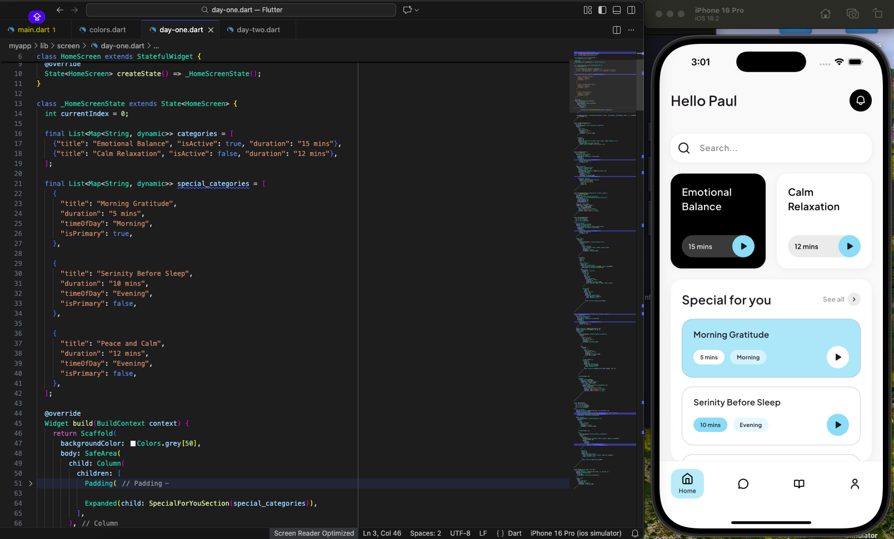

# Flutter 100 Days of Code 🚀  
## Day 1 – Flutter Health App

This is **Day 1** of my **Flutter 100 Days of Code** challenge.

In this project, we create a **simple Home Screen UI** for a **Flutter Health App**.

---

## 📹 Video Tutorial
Watch here:  
https://youtu.be/zrIow38ErYY

---

## 📚 What’s Covered
- Flutter UI basics
- Home screen layout
- Widget structure
- Clean UI design

---

## 🛠 Tech Stack
- Flutter
- Dart

---

## 📅 Day 1


---

## 🚀 Getting Started
1. Clone the repository
   ```bash
   git clone https://github.com/uchegeorge-tech/Flutter-Health-App.git
